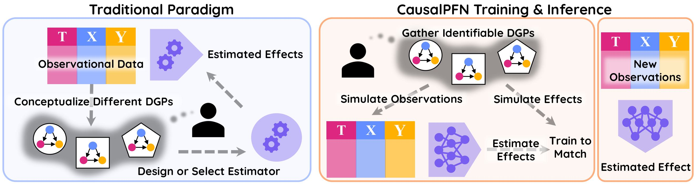
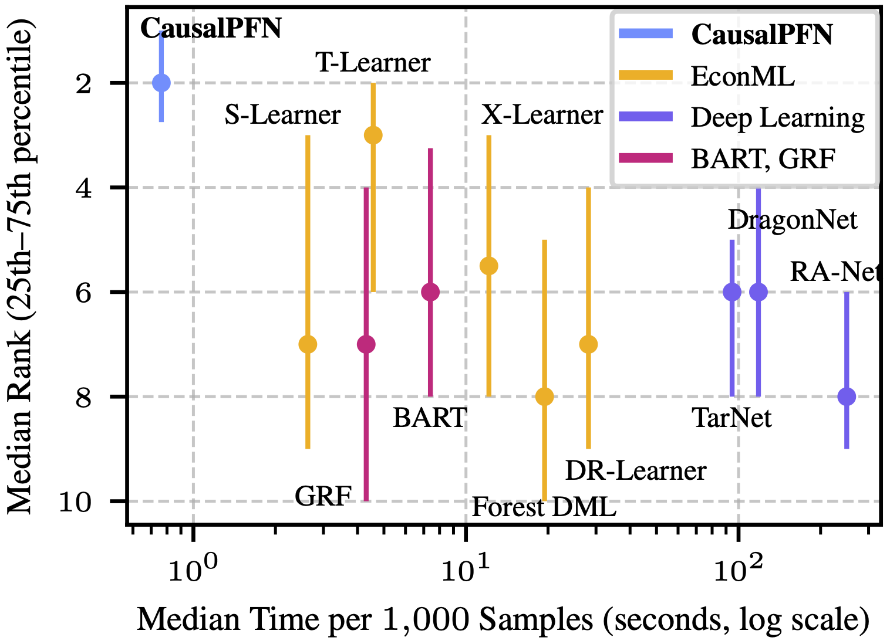

# CausalPFN: Amortized Causal Effect Estimation via In-Context Learning

<div align="center">

[](https://www.python.org/)
[](https://pytorch.org/)
[](LICENSE)
[](#)
[](https://pypi.org/project/causalpfn/0.1.0/)

**An easy-to-use library for causal effect estimation using transformer-based in-context learning**

[🛠️ Installation](#installation) • [🚀 Quick Start](#quick-start) • [📊 Examples](#examples) • [🔬 Reproducibility](#reproducibility)

</div>

---

## 🌟 Overview

CausalPFN leverages the power of transformer architectures for amortized causal effect estimation, enabling fast and accurate inference across diverse causal scenarios without the need for retraining. Our approach combines the flexibility of in-context learning with the rigor of causal inference.

<div align="center">
  
</div>

### ✨ Key Features

- **🚀 Fast Inference**: Amortized learning enables rapid causal effect estimation without retraining
- **🎯 Versatile**: Supports both CATE (Conditional Average Treatment Effect) and ATE (Average Treatment Effect) estimation
- **🔄 Amortized Learning**: Single model handles multiple causal estimation tasks
- **🧮 Uncertainty Quantification**: Built-in calibration and confidence estimation
- **⚡ GPU Accelerated**: Optimized for modern hardware with CUDA support
- **📈 Benchmarked**: Competitive performance against state-of-the-art causal inference methods

## Installation

### Via PyPI
```bash
pip install causalpfn
```

### Requirements
- Python 3.10+
- PyTorch 2.0+
- NumPy
- scikit-learn
- tqdm
- faiss-cpu
- huggingface_hub
- econml

## Quick Start

Here's a complete example demonstrating CausalPFN for causal effect estimation:

```python
import numpy as np
import torch
import time
from causalpfn import CATEEstimator, ATEEstimator

device = torch.device("cuda:0" if torch.cuda.is_available() else "cpu")

# 1. Generate synthetic data
np.random.seed(42)
n, d = 20000, 5
X = np.random.normal(1, 1, size=(n, d)).astype(np.float32)

# Define true causal effects
def true_cate(x):
    return np.sin(x[:, 0]) + 0.5 * x[:, 1]

def true_ate():
    return np.mean(true_cate(X))

# Generate treatment and outcomes
tau = true_cate(X).astype(np.float32)
T = np.random.binomial(1, p=0.5, size=n).astype(np.float32)
Y0 = X[:, 0] - X[:, 1] + np.random.normal(0, 0.1, size=n).astype(np.float32)
Y1 = Y0 + tau
Y = Y0 * (1 - T) + Y1 * T

# 2. Train/test split
train_idx = np.random.choice(n, size=int(0.7 * n), replace=False)
test_idx = np.setdiff1d(np.arange(n), train_idx)
X_train, X_test = X[train_idx], X[test_idx]
T_train, Y_train = T[train_idx], Y[train_idx]
tau_test = tau[test_idx]

# 3. CATE Estimation
start_time = time.time()
causalpfn_cate = CATEEstimator(
    device=device,
    verbose=True,
)
causalpfn_cate.fit(X_train, T_train, Y_train)
cate_hat = causalpfn_cate.estimate_cate(X_test)
cate_time = time.time() - start_time

# 4. ATE Estimation
causalpfn_ate = ATEEstimator(
    device=device,
    verbose=True,
)
causalpfn_ate.fit(X, T, Y)
ate_hat = causalpfn_ate.estimate_ate()

# 5. Evaluation
pehe = np.sqrt(np.mean((cate_hat - tau_test) ** 2))
ate_rel_error = np.abs((ate_hat - true_ate()) / true_ate())

print(f"📊 Results:")
print(f"ATE Relative Error: {ate_rel_error:.4f}")
print(f"PEHE: {pehe:.4f}")
print(f"⚡ CATE estimation time per 1000 samples: {cate_time / (len(X) / 1000):.4f}s")
```

## Examples

Explore our comprehensive notebook collection below. Before running the notebooks, make sure to install the additional dependencies via `pip install .[dev]`.

| Notebook | Description | Features |
|----------|-------------|----------|
| [🎯 Causal Effect Estimation](notebooks/causal_effect.ipynb) | Compare CausalPFN with baseline methods | CATE/ATE estimation, benchmarking |
| [📈 Hillstrom Marketing](notebooks/hillstrom_marketing.ipynb) | Uplift modeling case study | Real-world marketing application |
| [🎲 Calibration Analysis](notebooks/calibration.ipynb) | Uncertainty quantification demo | Confidence intervals, calibration |

## Performance Benchmark


<p align="center">
  
</p>

*Time vs. Performance. Comparison across 130 causal inference tasks from IHDP, ACIC, and Lalonde. CausalPFN achieves the best average rank (by precision in estimation of heterogeneous effect) while being much faster than other baselines.*

## Reproducibility

To fully reproduce the paper results, see the [REPRODUCE](REPRODUCE.md) file.

## Citation

If you use CausalPFN in your research, please cite our paper:

```bibtex
@misc{causalpfn2025,
      title={CausalPFN: Amortized Causal Effect Estimation via In-Context Learning},
      author={Vahid Balazadeh and Hamidreza Kamkari and Valentin Thomas and Benson Li and Junwei Ma and Jesse C. Cresswell and Rahul G. Krishnan},
      year={2025},
      primaryClass={cs.LG},
}
```

## Contributing

We welcome contributions! Please feel free to submit a Pull Request.

1. Fork the repository
2. Create a feature branch (`git checkout -b feature/amazing-feature`)
3. Commit your changes (`git commit -m 'Add amazing feature'`)
4. Push to the branch (`git push origin feature/amazing-feature`)
5. Open a Pull Request

## License

This project is licensed under the Apache-2.0 License - see the [LICENSE](LICENSE) file for details.

---

<div align="center">

**[⭐ Star us on GitHub](https://github.com/vdblm/causalpfn)** • **[🐛 Report Bug](https://github.com/vdblm/causalpfn/issues)** • **[💡 Request Feature](https://github.com/vdblm/causalpfn/issues)**

Made with ❤️ for better causal inference

</div>
